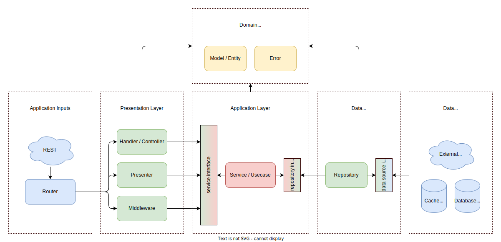

# Saas Backend

This project is made for learning purposes. The main objective of this project is to allow developers to quickly implement SaaS backend features by providing commonly used SaaS features for subscription service.

## Architecture

This project's architecture follows the [Uncle Bob's Clean Architecture](https://blog.cleancoder.com/uncle-bob/2012/08/13/the-clean-architecture.html). The color code used in the diagram is the same as in the blog.

### Application Inputs

This layer, as the name suggest, is responsible for handling the inputs of the application. The inputs can be a command line arguments, a file, or in this project's case, an HTTP request. The router will accepts the incoming requests and route said requests to the Presentation Layer.

### Presentation Layer

This layer is responsible for handling the incoming requests that are routed by the router. The Presentation Layer will parse and validate incoming requests and pass the data to the Application Layer.

### Application Layer

This layer is responsible for handling the business logic. The Application Layer will use the data passed by the Presentation Layer to perform business logic. This layer also utilize the interfaces of the Data Layer (Dependency Inversion Principle) to read or write data. In Uncle Bob's blog, this part is called "use case", but I prefer to call it "service" because the name "use case" is commonly used in non-technical documents.

### Data Layer

This layer is responsible for communicating with data sources. The Data Layer will parse the data from the Application Layer in the form of Entities or Models to classes best fit for the Data Sources. The Data Layer will also parse the data from the Data Sources to Entities or Models to fit the Application Layer. This layer communicate with Data Sources using Dependency Inversion Principle.

### Data Sources

This layer is responsible for storing data. The Data Sources can be a database, a cache, a message broker, or a third-party (external) services. In this project, most of the Data Sources components, if not all, will come from libraries like Gorm and Stripe. That's why the Data Sources interfaces are not defined in this project, instead they are defined in the libraries.

## Getting Started

Make sure you have Go v1.20 installed before running this project. TODO: Continue and add frontend repository

## Features

The main features will be listed as a header. The smaller features will be listed under the main feature as checkbox. A main feature can have an additional feature that will be listed as a smaller header. A checked box means the feature is already implemented. Here are the list of features:

### User Authentication
- [ ] User registration with email and password
- [ ] Send email verification after registration
- [ ] Resend email verification
- [ ] Option to enable or disable email verification
- [ ] Reset password
- [ ] User login
- [ ] User logout
- [ ] User change password once logged in

#### More User Authentication
- [ ] Add option to use Firebase authentication
- [ ] Add option to use Auth0 authentication

### Profile
- [ ] Create user profile
- [ ] Update user profile
- [ ] Get user profile

### Payment (Stripe)
- [ ] Edit account billing information
- [ ] Add credit card
- [ ] Remove credit card
- [ ] Set default credit card
- [ ] 3D Secure payment
- [ ] Free trial (card required)
- [ ] Free trial (card not required)
- [ ] Free tier
- [ ] Subscription start
- [ ] Subscription plan upgrade
- [ ] Subscription plan downgrade
- [ ] Subscription cancel
- [ ] New subscriber email
- [ ] Successful payments email
- [ ] Failed payments email
- [ ] Expiring trial email
- [ ] Failed automatic payments email
- [ ] Account suspension email

### Fixes
- [ ] Remove commonly repeated code like getting user from auth ID
- [ ] Better error handling

### Others
- [ ] API documentation
- [ ] Monitoring
- [ ] Docker support
- [ ] Add message broker

## Author

Kevin Dharmawan